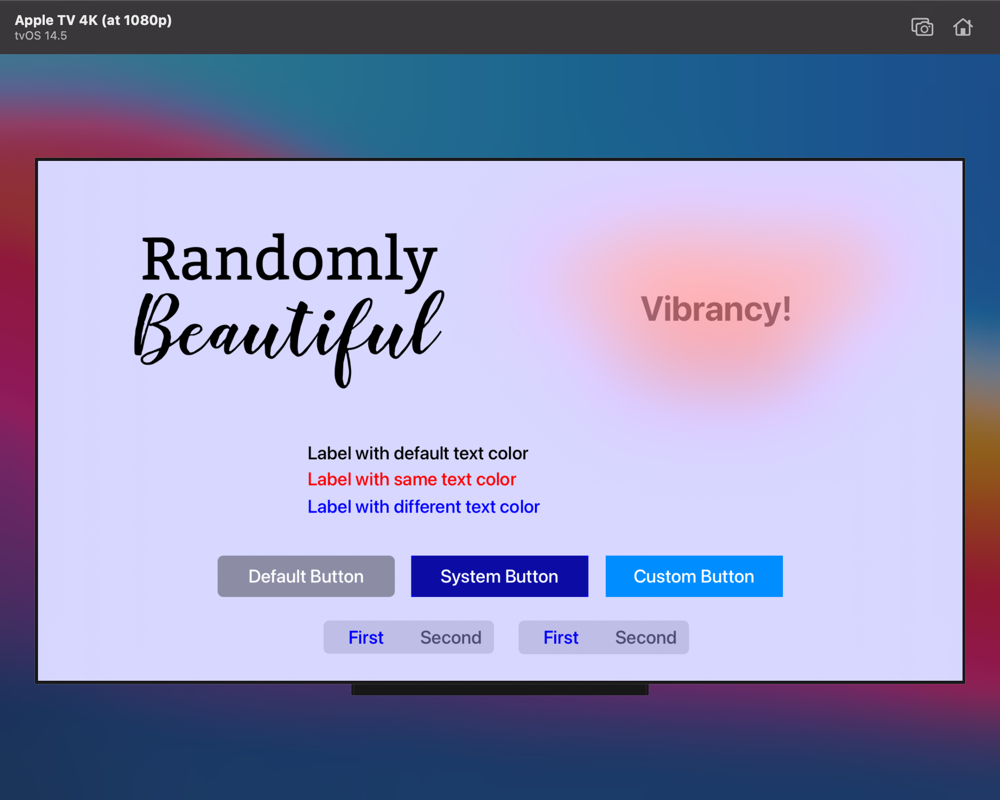
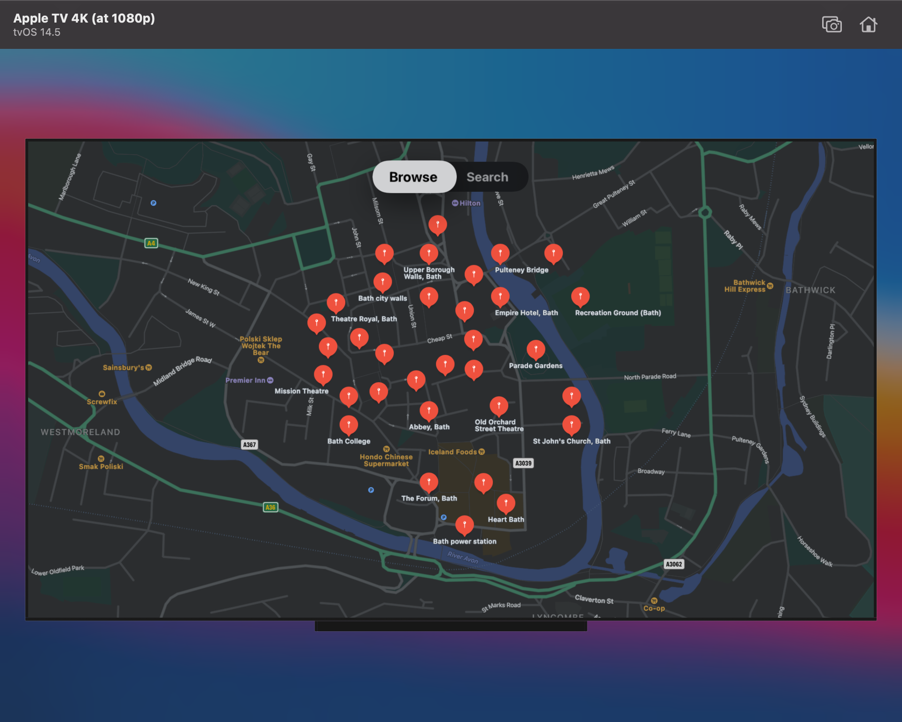
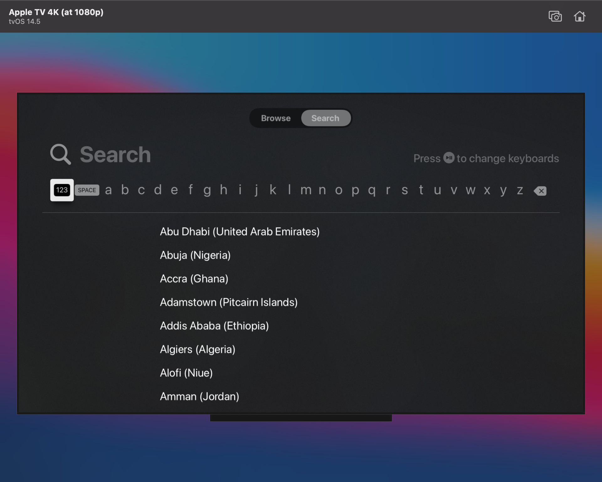
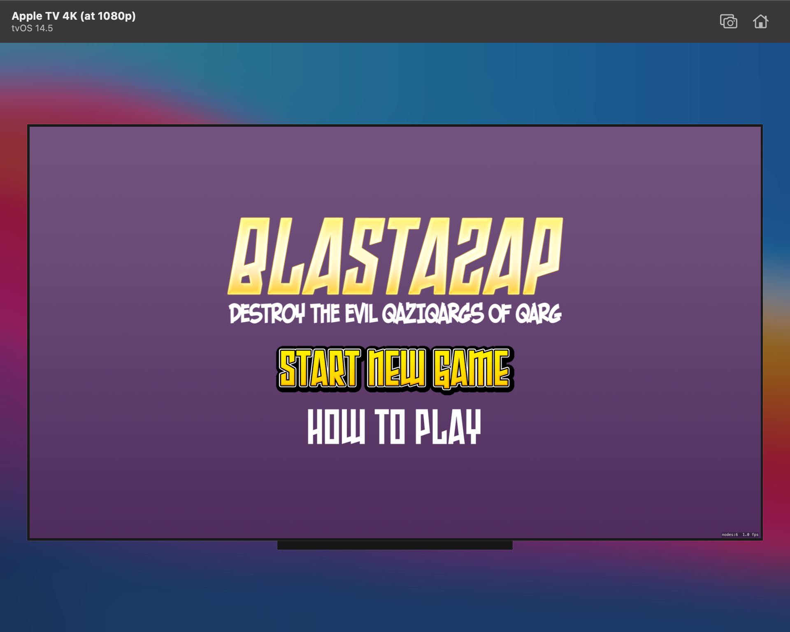
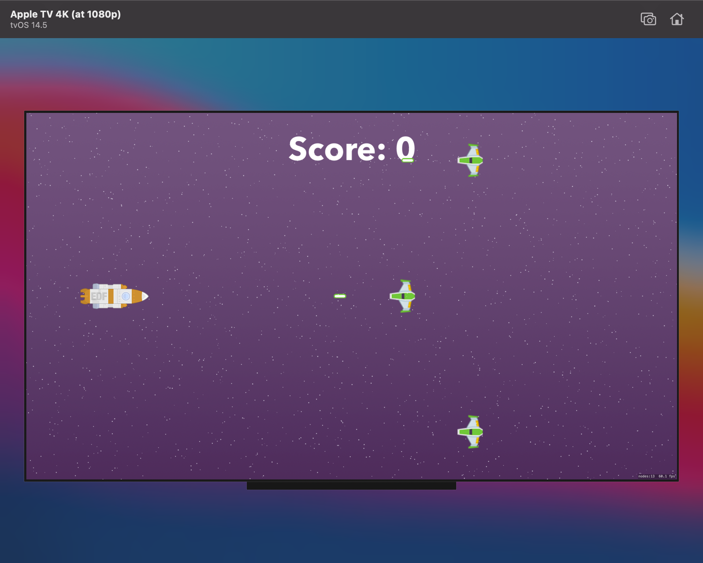
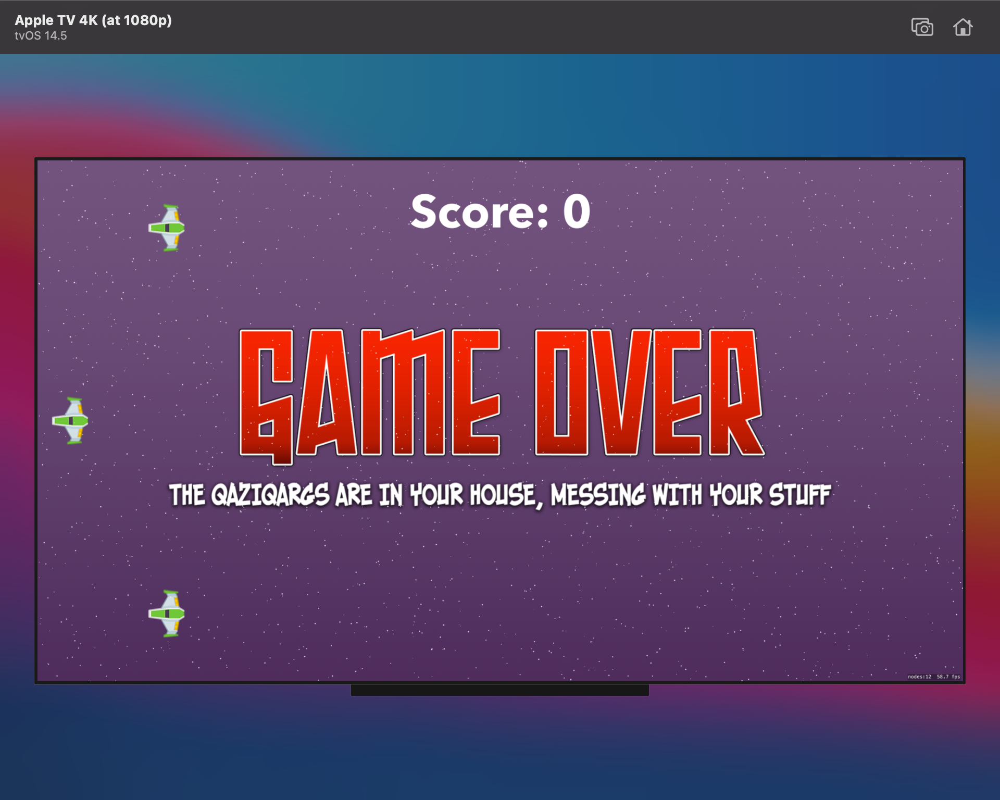
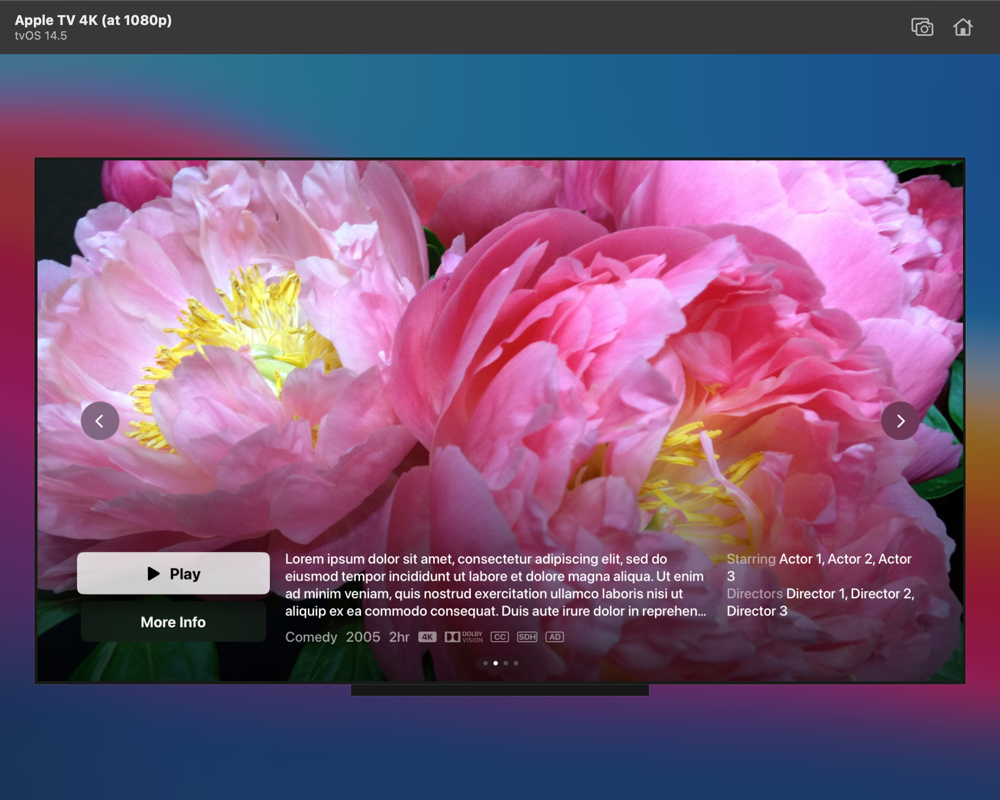
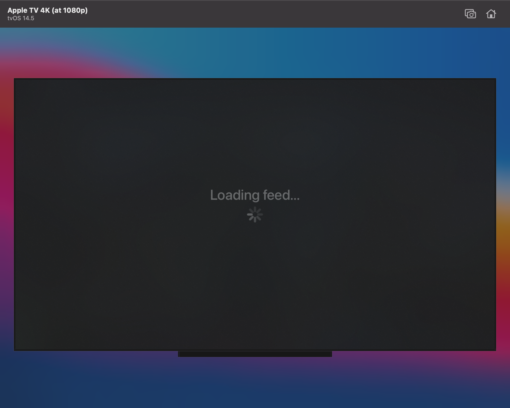
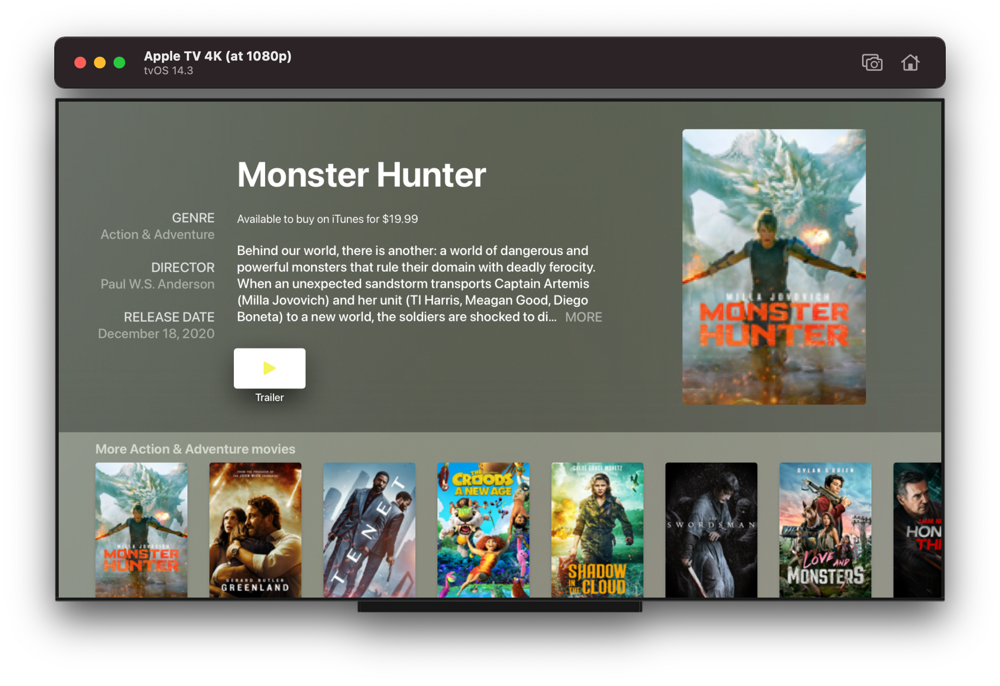
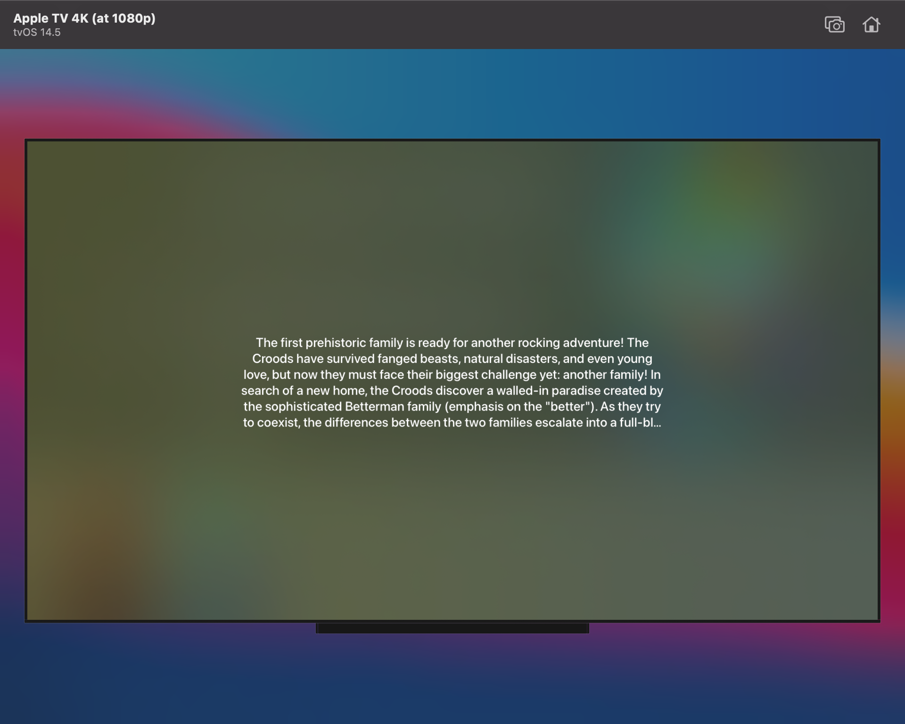

# Practice_tvOS

[Hacking with tvOS](https://www.hackingwithswift.com/store/hacking-with-tvos)

### Chapter 1

### Chapter 2

### Chapter 3

### Chapter 4

### Chapter 5

### Chapter 6

### Chapter 7

### Chapter 8

### FullScreenTopShelf (replacement of Chapter 9)

[Building a Full Screen Top Shelf Extension (Apple)](https://developer.apple.com/documentation/tvservices/building_a_full_screen_top_shelf_extension?changes=__3_1)

### Chapter 10

